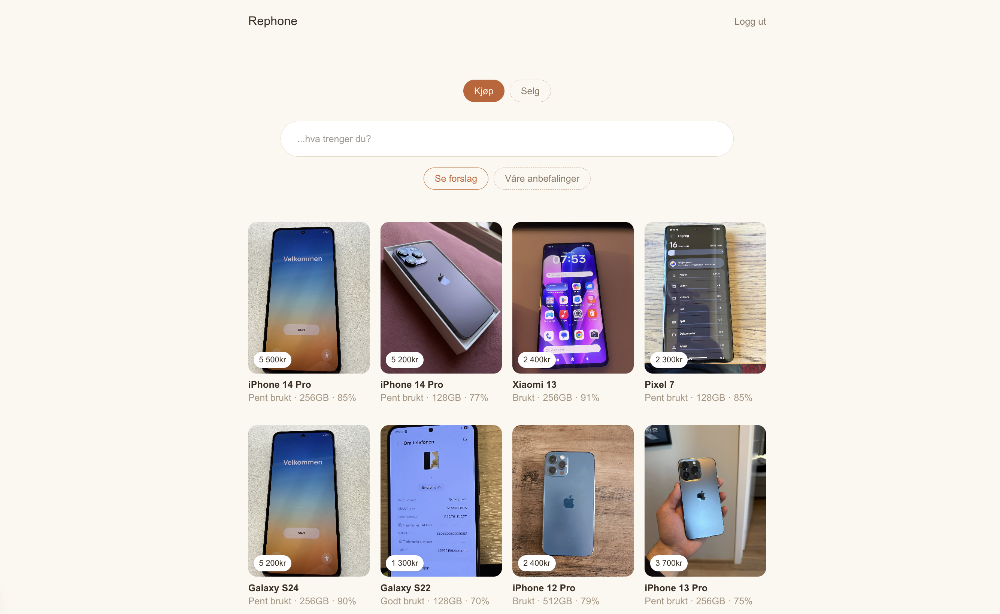

# Rephone 📱


A marketplace for used phones where the AI never guesses without data. Search in plain language, get price suggestions grounded in real listings and reference prices, and publish a listing in a few steps.

**[Live Demo](rephone-rho.vercel.app)**



---

## Features

- **Natural language search** — Write "an iPhone under 4000 kr, over 80% battery health and at least 256 GB" and get matching listings, with the interpreted filters shown as chips
- **AI price suggestion** — Describe your phone in free text and get brand, model, condition, battery health, storage and a suggested price
- **Editable draft** — Fix anything the AI got wrong. Condition and storage are dropdowns, and the price updates when you change storage, battery health or condition
- **AI-written ad text** — Generate a short, honest description from the draft details
- **Image upload** — Upload photos to Vercel Blob, shown on listing cards and the detail page
- **Auth** — Register and log in with email and password. Only logged-in users can publish, and only the owner can edit or delete a listing
- **Listing cards and detail page** — Portrait cards with a price badge, and a side-by-side detail page

---

## How the AI works

The AI is built around one rule: **retrieve real data first, then let the model reason over it.**

**Search (buy)**

1. Claude interprets the free text into structured filters (budget, brand, minimum battery health, minimum storage, priorities)
2. A normal Prisma query fetches real listings that match the filters
3. Claude writes a short reason for each real match

**Price suggestion (sell)**

1. Claude interprets the description into brand, model, condition, battery health and storage
2. The database is queried for similar active listings **and** a manually seeded reference price table
3. Claude suggests a price, with real listings prioritised over reference prices
4. If neither source has data, the app refuses to guess and says so

**Price adjustment**
When a field in the draft changes, the new price is calculated in plain code (storage steps and a battery health penalty), and only the first suggestion comes from the model. This came out of testing: the model was not consistent enough for a purely numeric adjustment.

---

## Tech Stack

- **Next.js** (App Router) — Framework
- **React** and **TypeScript** — UI
- **Tailwind CSS** — Styling
- **PostgreSQL on Neon** — Database
- **Prisma** — ORM, with the `PrismaPg` driver adapter
- **Auth.js (NextAuth)** — Credentials login with JWT sessions, passwords hashed with bcrypt
- **Anthropic Claude API** — Search interpretation, price suggestions and ad text
- **Vercel Blob** — Image storage
- **Vercel** — Deployment

---

## Getting Started

### Prerequisites

- Node.js
- A PostgreSQL database (for example on [Neon](https://neon.tech))
- An [Anthropic API key](https://console.anthropic.com)
- A [Vercel Blob](https://vercel.com/docs/vercel-blob) store with public access

### Installation

```bash
git clone https://github.com/NikolaiVFredriksen/Rephone
cd Rephone
npm install
```

### Environment Variables

Create a `.env` file in the root:

```
DATABASE_URL=your_postgres_connection_string
ANTHROPIC_API_KEY=your_anthropic_api_key
AUTH_SECRET=a_long_random_string
BLOB_READ_WRITE_TOKEN=your_vercel_blob_token
```

### Database Setup

```bash
npx prisma migrate dev
npx prisma generate
npx tsx prisma/seed-reference-prices.ts
```

The seed script fills the reference price table with approximate used prices for common iPhone, Samsung, Pixel and Xiaomi models in three conditions.

### Run Locally

```bash
npm run dev
```

---

## Project Structure

```
prisma/
├── schema.prisma
└── seed-reference-prices.ts
src/
├── app/
│   ├── api/
│   │   ├── search/
│   │   ├── price-suggestion/
│   │   ├── adjust-price/
│   │   ├── generate-description/
│   │   ├── listings/
│   │   ├── upload/
│   │   ├── register/
│   │   └── auth/
│   ├── annonse/[id]/
│   ├── logg-inn/
│   ├── registrer/
│   └── page.tsx
├── components/
│   ├── shared/   (Header, BuySellToggle, ListingCard, ResultsGrid)
│   ├── buy/      (BuyFlow, FilterChips)
│   ├── sell/     (SellFlow, ImageUploader, EditDraftStep, GenerateDescription)
│   └── HomeContent.tsx
├── lib/
│   └── prisma.ts
└── auth.ts
```

---

## Known Limitations

- Only the first uploaded image is stored on a listing
- Images are not analysed by the AI yet. Condition, storage and battery health come from the seller's text, so the draft is only as accurate as the description

## Roadmap

**Vision, next up.** Images are already uploaded and stored, so the next step is to send them to a vision-capable Claude model and use what it sees to ground the draft:

- Read the settings screenshot (battery health, storage, model name) and fill those fields from the image instead of relying on typed text
- Assess visible condition (cracks, scratches, wear) and suggest `Pent brukt`, `Brukt` or `Godt brukt`
- Flag mismatches, for example a description saying "like new" next to a photo of a cracked screen
- Let the price suggestion use the vision result as another grounded input, next to real listings and reference prices
- Keep the seller in control: vision only pre-fills the editable draft, and every field can still be changed

**After that**

- Real-time market prices through a pricing API or a web search tool for the model
- Multiple images per listing

---

## Author

Nikolai Villanueva Fredriksen
[GitHub](https://github.com/NikolaiVFredriksen)
